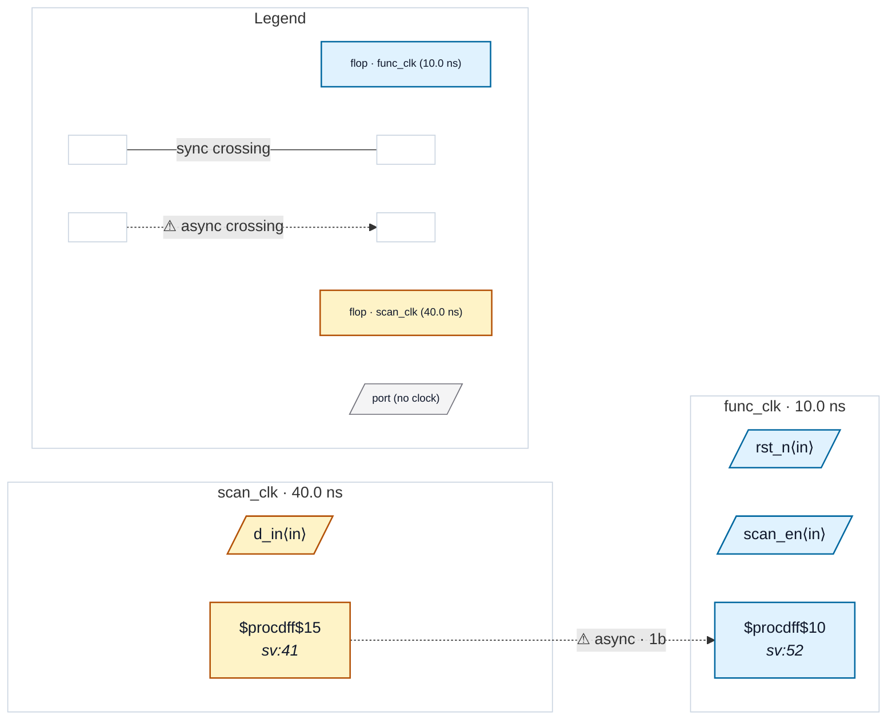

# Fixture: `good_scan_mode_ignored`

<!-- generator: scripts/gen_fixture_docs.py -->

`--ignore-scan-mode` positive case (issue #45) — every async crossing in this design exists only because of the DFT scan clock mux, so the flag clears the report and its absence leaves it firing.

`dst_q` is clocked through `$mux(S=scan_en, A=func_clk, B=scan_clk)` — the textbook scan-mux shape a DFT insertion flow drops in front of a flop so the scan chain can shift on the tester's clock. The two legs are asynchronous to each other, so the analyzer resolves the muxed net to one of them (`func_clk`, the first leg that resolves) while the source flop `src_q` sits in `scan_clk`. The result reads as an unsynchronized `scan_clk -> func_clk` control crossing and CDC-001 fires — even though the two clocks never drive this flop in the same mode, and the scan path is not exercised functionally.

The `(* scan_en *)` attribute on the select port is what tells the analyzer which pin is the test-mode control. With `--ignore-scan-mode` the crossing is skipped and the design reports clean; without it, nothing changes and CDC-001 still fires. The crossing is always *tagged*, never dropped, and the suppressed count is reported.

```text
Build:
  yosys -p 'read_verilog -sv good_scan_mode_ignored.sv; \
            hierarchy -top good_scan_mode_ignored; proc; flatten; \
            write_json good_scan_mode_ignored.json'
```

- **Status:** positive — textbook fix; analyzer must stay silent
- **Top module:** `good_scan_mode_ignored`
- **Clocks:** `func_clk` (10.0 ns), `scan_clk` (40.0 ns)
- **Crossings:** 1 structural (1 async-per-SDC, 0 sync)

## Clock-domain map



## Files

- `good_scan_mode_ignored.json`
- `good_scan_mode_ignored.sdc`
- `good_scan_mode_ignored.sv`

---
*Generated by `scripts/gen_fixture_docs.py` — re-run after editing the SV/SDC/netlist.*
