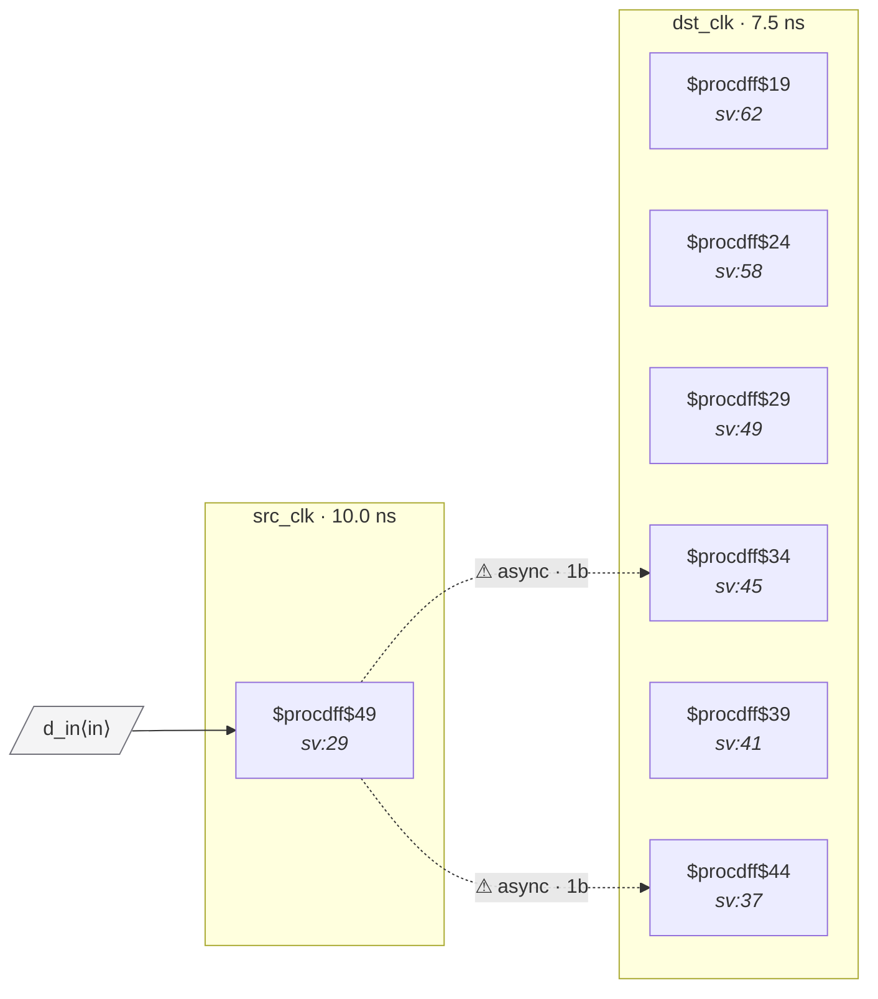

# Fixture: `good_single_source_fanout_sync_chains`

<!-- generator: scripts/gen_fixture_docs.py -->

Single source flop fanning out to two independent sync chains.

Same shape as `bad_reconvergent_sync` — one src_q feeds two 2FF synchronizer chains in dst_clk — BUT the two synchronized outputs drive disjoint downstream registers and disjoint output ports. There is no cell observing both synchronized values, so CDC-005's forward-cone reconvergence filter must NOT fire.

Distinct from `good_disjoint_fanout_sync_chains` (which uses two independent source flops): this fixture keeps the "single source, multiple chains" topology specifically. CDC-005's single-source fan-out detection has to walk the shared src_q through both chains and confirm the downstream cones are disjoint — testing that the shared-source path resolves cleanly.

Paired with `bad_reconvergent_sync` (must fire) and with `good_disjoint_fanout_sync_chains` (two-source variant).

- **Status:** positive — textbook fix; analyzer must stay silent
- **Top module:** `good_single_source_fanout_sync_chains`
- **Clocks:** `dst_clk` (7.5 ns), `src_clk` (10.0 ns)
- **Crossings:** 2 structural (2 async-per-SDC, 0 sync)

## Clock-domain map

## Files

- `good_single_source_fanout_sync_chains.json`
- `good_single_source_fanout_sync_chains.sdc`
- `good_single_source_fanout_sync_chains.sv`

---
*Generated by `scripts/gen_fixture_docs.py` — re-run after editing the SV/SDC/netlist.*
