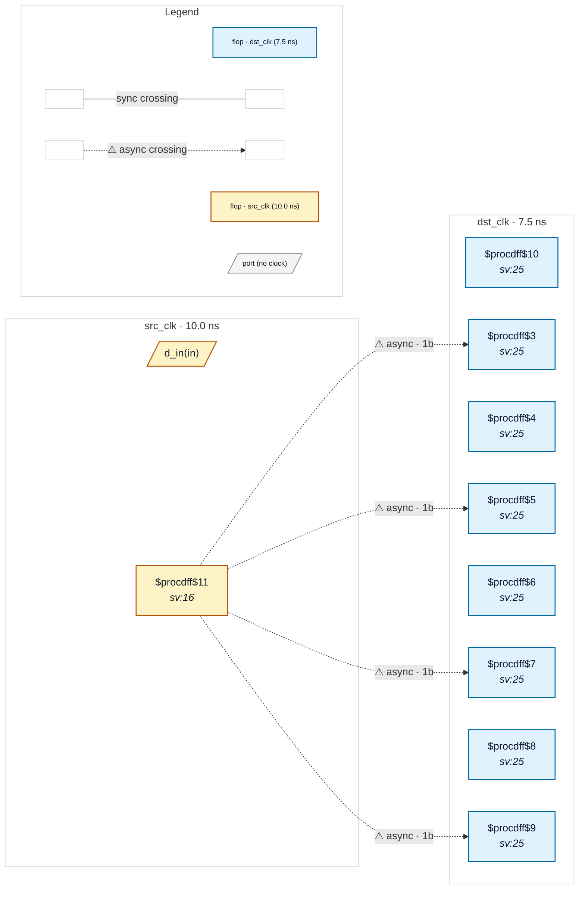

# Fixture: `good_sliced_bus_gray_marked`

<!-- generator: scripts/gen_fixture_docs.py -->

Positive counterpart to bad_sliced_bus_reconvergence.

Same sliced-bus per-lane-sync shape, but the source register is marked `(* cdc_gray *)` to vouch that the bus is gray-coded (at most one bit transitions per src cycle). CDC-020 must stay silent on the gray-coded source.

- **Status:** positive — textbook fix; analyzer must stay silent
- **Top module:** `good_sliced_bus_gray_marked`
- **Clocks:** `dst_clk` (7.5 ns), `src_clk` (10.0 ns)
- **Crossings:** 4 structural (4 async-per-SDC, 0 sync)

## Clock-domain map

## Files

- `good_sliced_bus_gray_marked.json`
- `good_sliced_bus_gray_marked.sdc`
- `good_sliced_bus_gray_marked.sv`

---
*Generated by `scripts/gen_fixture_docs.py` — re-run after editing the SV/SDC/netlist.*
