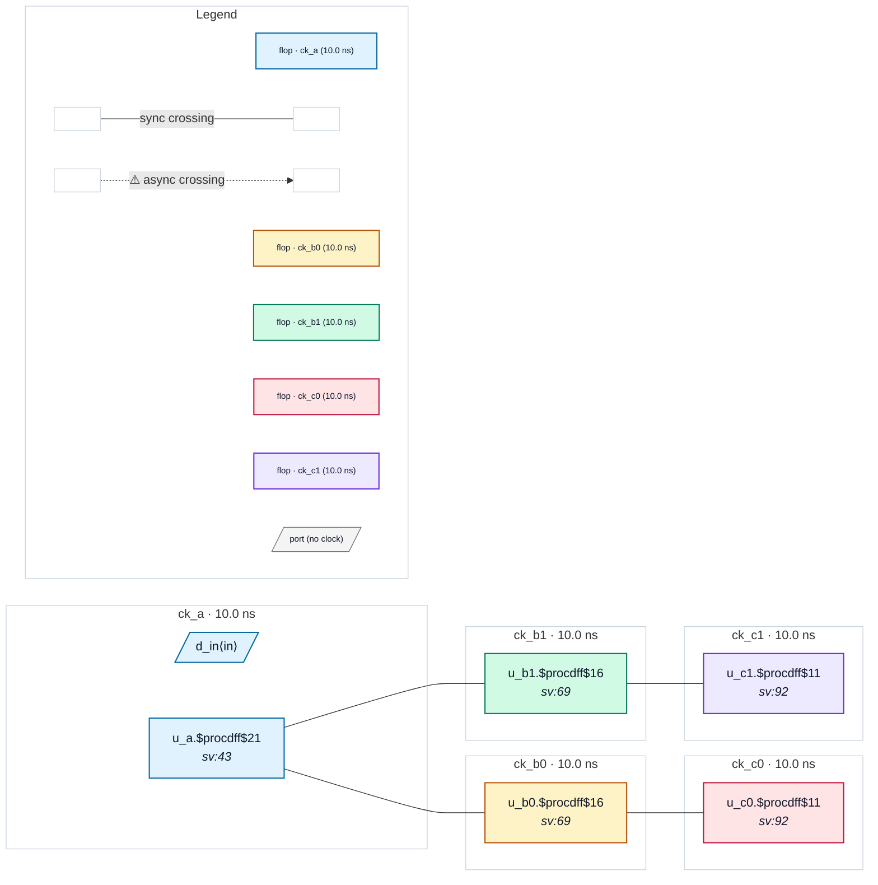

# Fixture: `good_source_sync_chain`

<!-- generator: scripts/gen_fixture_docs.py -->

Positive fixture: a source-synchronous datapath topology.

```text
    A ──► B0 ──► C0
     └──► B1 ──► C1
```

Each block (A, B0, B1, C0, C1) is its own clock domain. Every block exposes the source-synchronous API:

```text
    clk_in  : the block's local capture clock
    clk_out : the same clock forwarded out alongside the data
              (modelled here with an internal clock buffer)
```

In real silicon, an upstream block's ``clk_out`` is routed (board trace, chip pad, repeater chain) to the downstream block's ``clk_in``. At lint scope we model the forwarded clock as a distinct top-level input port per block — that mirrors how SoC integration usually presents the system to a CDC tool — and route each block's ``clk_out`` to a top-level output port representing the forwarded clock leaving the chip.

Links are direct flop-to-flop captures with no synchronizer (correct for source-sync timing). The CDC contract is "the system SDC must declare each link's two clocks as related". The paired SDC uses ``create_generated_clock`` so all five clocks collapse to ck_a's master domain — the analyzer sees four raw clock-name mismatches but ``are_async`` returns False for each, so zero async crossings and zero violations are reported.

The negative counterpart ``bad_source_sync_chain`` uses identical RTL but a system SDC that fails to declare the relations, and must fire CDC-001 on each of the four links.

- **Status:** positive — textbook fix; analyzer must stay silent
- **Top module:** `good_source_sync_chain`
- **Clocks:** `ck_a` (10.0 ns), `ck_b0` (10.0 ns), `ck_b1` (10.0 ns), `ck_c0` (10.0 ns), `ck_c1` (10.0 ns)
- **Crossings:** 4 structural (0 async-per-SDC, 4 sync)

## Clock-domain map



## Files

- `good_source_sync_chain.json`
- `good_source_sync_chain.sdc`
- `good_source_sync_chain.sv`

---
*Generated by `scripts/gen_fixture_docs.py` — re-run after editing the SV/SDC/netlist.*
