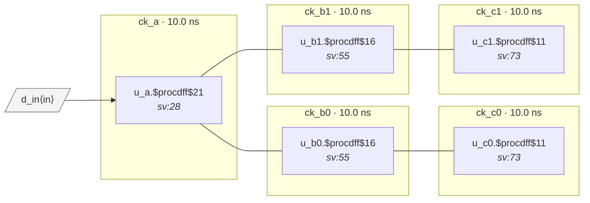

# Fixture: `good_source_sync_internal`

<!-- generator: scripts/gen_fixture_docs.py -->

Positive fixture: source-synchronous chain wired *internally*.

```text
    A ──► B0 ──► C0
     └──► B1 ──► C1
```

Same topology as ``good_source_sync_chain`` but the forwarded clocks are not exposed as top-level ports. The only top-level clock input is ``ck_a``; A's clock-buffer outputs drive B0/B1's clock inputs directly through internal wires, and B0/B1's outputs drive C0/C1.

The CDC contract here is that the system SDC declares each forwarded clock with ``create_generated_clock`` on the internal pin where it originates (e.g. ``[get_pins u_a/clk_out_b0]`` declares ``ck_b0``). The analyzer must stop tracing each flop's clock root at that pin and adopt the generated clock's identity, so that ck_b0 resolves to ck_a's master domain but is still distinct from ck_a as a clock name. Zero async crossings, zero violations.

- **Status:** positive — textbook fix; analyzer must stay silent
- **Top module:** `good_source_sync_internal`
- **Clocks:** `ck_a` (10.0 ns), `ck_b0` (10.0 ns), `ck_b1` (10.0 ns), `ck_c0` (10.0 ns), `ck_c1` (10.0 ns)
- **Crossings:** 4 structural (0 async-per-SDC, 4 sync)

## Clock-domain map



## Files

- `good_source_sync_internal.json`
- `good_source_sync_internal.sdc`
- `good_source_sync_internal.sv`

---
*Generated by `scripts/gen_fixture_docs.py` — re-run after editing the SV/SDC/netlist.*
