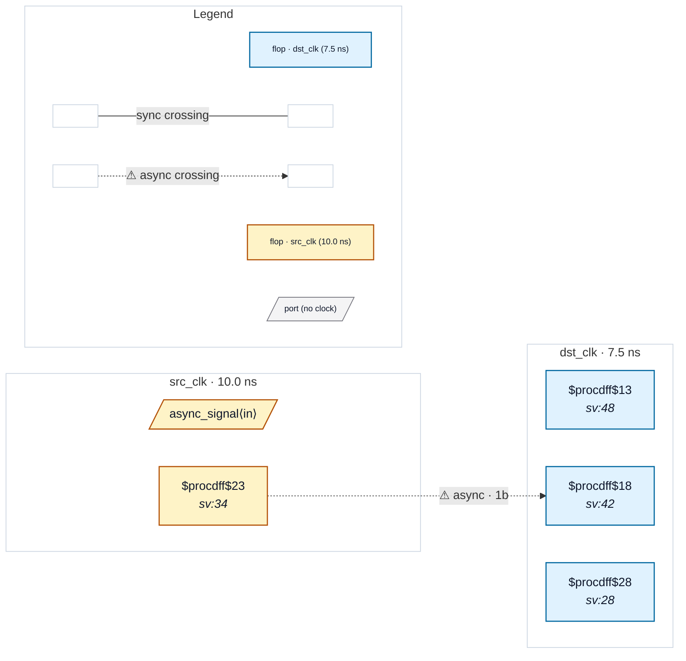

# Fixture: `good_sync_chain_local_reset`

<!-- generator: scripts/gen_fixture_docs.py -->

Positive counterpart to `bad_sync_chain_foreign_reset` (issue #172).

Structurally identical: a 2FF sync chain in dst_clk samples a cross-domain signal from src_clk. The fix versus the bad fixture is that the chain's ARST is now sourced from a dst_clk-domain reset flop (`dst_rst_q`), so the chain's resolving flops are released synchronously with their own clock. The classic "async-assert, sync-deassert" reset distribution shape.

CDC-015 must not fire; the chain's reset domain matches its clock domain. The crossing-data path is the same single-bit 2FF idiom every other good fixture uses, so no other rule fires.

- **Status:** positive — textbook fix; analyzer must stay silent
- **Top module:** `good_sync_chain_local_reset`
- **Clocks:** `dst_clk` (7.5 ns), `src_clk` (10.0 ns)
- **Crossings:** 1 structural (1 async-per-SDC, 0 sync)

## Clock-domain map

## Files

- `good_sync_chain_local_reset.json`
- `good_sync_chain_local_reset.sdc`
- `good_sync_chain_local_reset.sv`

---
*Generated by `scripts/gen_fixture_docs.py` — re-run after editing the SV/SDC/netlist.*
