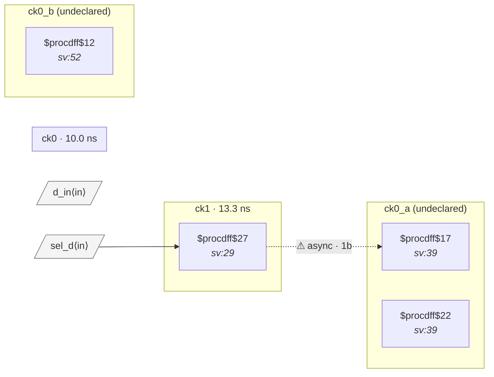

# Fixture: `good_sync_clock_mux`

<!-- generator: scripts/gen_fixture_docs.py -->

CDC-010 paired fix — synchronize the mux select into the destination-clock domain before it reaches the clock mux.

(For a real clock mux you'd use a glitch-free clock-mux library cell with its own internal hand-off; this fixture shows the structural fix the rule recognises: with the select sampled into `ck0` via a 2FF synchronizer, the rule's backward-flop-fanin walk finds a same-domain flop on the mux's select pin and stays silent.)

The ck1-domain `sel_q` flop is still present (carrying the user request); it crosses into the ck0 domain through the `(* cdc_sync *)` 2FF synchronizer (`sel_meta` → `sel_sync`). The downstream clock mux sees `sel_sync` — a ck0-domain flop — on its `S` pin, which falls inside the cell's clock-input-domain set `{ck0}`, so CDC-010 is silent.

- **Status:** positive — textbook fix; analyzer must stay silent
- **Top module:** `good_sync_clock_mux`
- **Clocks:** `ck0` (10.0 ns), `ck1` (13.3 ns)
- **Crossings:** 2 structural (1 async-per-SDC, 1 sync)

## Clock-domain map

## Files

- `good_sync_clock_mux.json`
- `good_sync_clock_mux.sdc`
- `good_sync_clock_mux.sv`

---
*Generated by `scripts/gen_fixture_docs.py` — re-run after editing the SV/SDC/netlist.*
