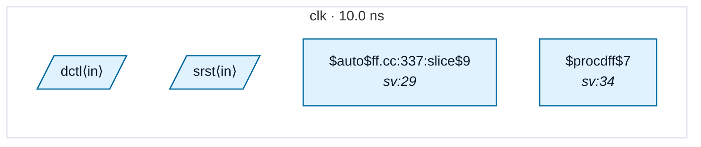

# Fixture: `good_typed_sync_reset`

<!-- generator: scripts/gen_fixture_docs.py -->

Positive counterpart to `bad_untyped_sync_reset_srst` (rtl-buddy-cdc#272) — the textbook fix for an untyped synchronous reset is to type it.

Identical RTL and identical `$sdff` lowering; the only difference is the SDC, which declares `set_input_delay -clock clk` on both `srst` and `dctl`. A synchronous reset is sampled on the destination clock edge exactly like any data input, so typing it to that clock is the correct assertion — and it is the advice CDC-011's message gives.

Once typed, the port is no longer carrying the `<unconstrained>` sentinel, so neither the D-pin crossing walk nor the `SRST` walk added in #272 can produce a finding. The analyzer must report clean.

```text
Build:
  yosys -p 'read_verilog -sv good_typed_sync_reset.sv;
            hierarchy -top good_typed_sync_reset;
            proc; opt_dff; flatten; opt_clean;
            write_json good_typed_sync_reset.json'
```

- **Status:** positive — textbook fix; analyzer must stay silent
- **Top module:** `good_typed_sync_reset`
- **Clocks:** `clk` (10.0 ns)
- **Crossings:** 0 structural (0 async-per-SDC, 0 sync)

## Clock-domain map



## Files

- `good_typed_sync_reset.json`
- `good_typed_sync_reset.sdc`
- `good_typed_sync_reset.sv`

---
*Generated by `scripts/gen_fixture_docs.py` — re-run after editing the SV/SDC/netlist.*
