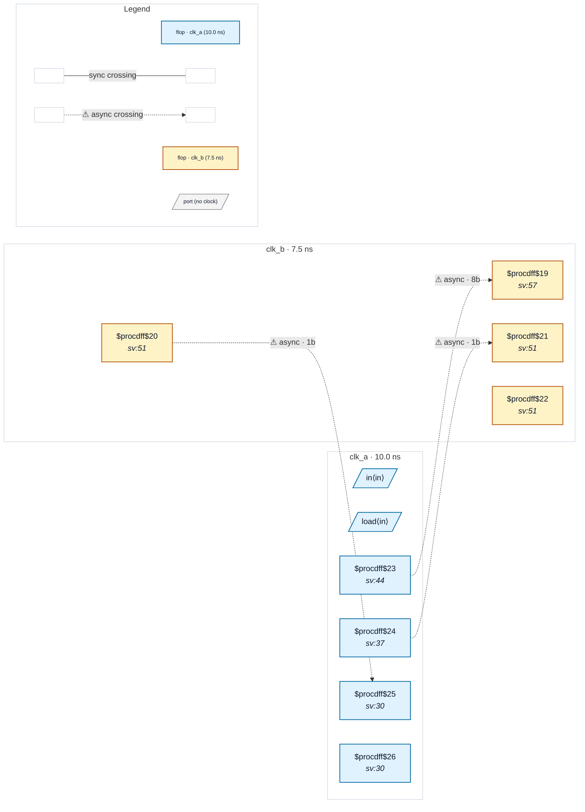

# Fixture: `good_unconstrained_input_bus_two_domains_typed`

<!-- generator: scripts/gen_fixture_docs.py -->

Positive counterpart to bad_unconstrained_input_bus_two_domains.

Bus variant of good_unconstrained_input_two_domains_typed — `in` and `load` are typed against clk_a; the clk_b capture is gated by a synchronised load bit. CDC-011 stays silent because the input is typed, and CDC-004 stays silent because the destination only samples the bus under a dst-domain synchronised enable.

The fixture also implements a full req/ack handshake between the two clock domains so CDC-012 (functional data-hold) stays silent: `q_a` is loaded only when arming a new request, held stable across the round-trip, and the request clears only when a synced-back ack confirms clk_b has sampled. Without the ack feedback the source payload could change between the request being registered and clk_b latching it — the CDC-012 failure mode.

- **Status:** positive — textbook fix; analyzer must stay silent
- **Top module:** `good_unconstrained_input_bus_two_domains_typed`
- **Clocks:** `clk_a` (10.0 ns), `clk_b` (7.5 ns)
- **Crossings:** 3 structural (3 async-per-SDC, 0 sync)

## Clock-domain map

## Files

- `good_unconstrained_input_bus_two_domains_typed.json`
- `good_unconstrained_input_bus_two_domains_typed.sdc`
- `good_unconstrained_input_bus_two_domains_typed.sv`

---
*Generated by `scripts/gen_fixture_docs.py` — re-run after editing the SV/SDC/netlist.*
