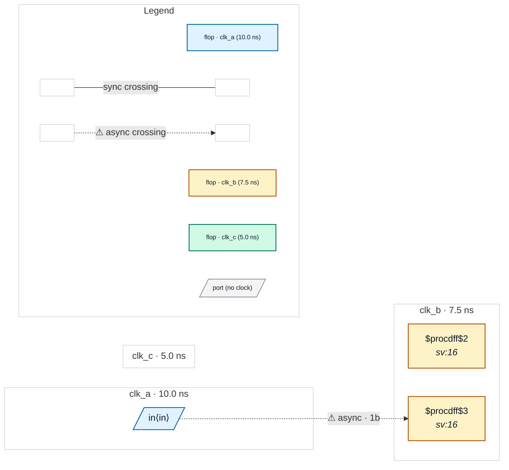

# Fixture: `good_unconstrained_input_derived_clock_typed`

<!-- generator: scripts/gen_fixture_docs.py -->

Positive counterpart to bad_unconstrained_input_derived_clock.

The SDC types `in` against clk_a, and the clk_b capture uses a textbook 2FF synchronizer. CDC-011 stays silent because the port is typed; CDC-001 stays silent because the async path is synchronized.

- **Status:** positive — textbook fix; analyzer must stay silent
- **Top module:** `good_unconstrained_input_derived_clock_typed`
- **Clocks:** `clk_a` (10.0 ns), `clk_b` (7.5 ns), `clk_c` (5.0 ns)
- **Crossings:** 1 structural (1 async-per-SDC, 0 sync)

## Clock-domain map

## Files

- `good_unconstrained_input_derived_clock_typed.json`
- `good_unconstrained_input_derived_clock_typed.sdc`
- `good_unconstrained_input_derived_clock_typed.sv`

---
*Generated by `scripts/gen_fixture_docs.py` — re-run after editing the SV/SDC/netlist.*
