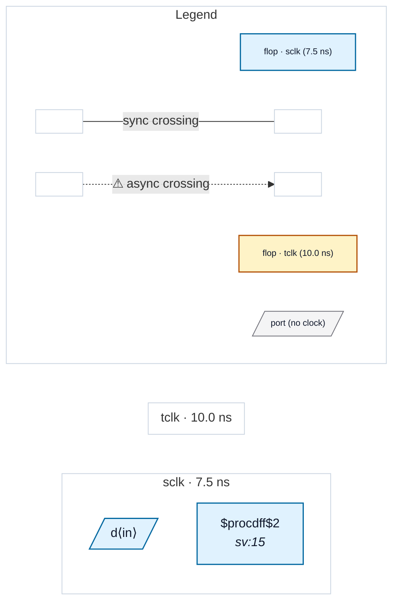

# Fixture: `good_unconstrained_input_muxed_clock_typed`

<!-- generator: scripts/gen_fixture_docs.py -->

Positive counterpart to bad_unconstrained_input_muxed_clock.

SDC types `d` against sclk, the same clock that captures it. CDC-011 stays silent because the port is typed; CDC-001/004 stay silent because there is no cross-domain data capture.

- **Status:** positive — textbook fix; analyzer must stay silent
- **Top module:** `good_unconstrained_input_muxed_clock_typed`
- **Clocks:** `sclk` (7.5 ns), `tclk` (10.0 ns)
- **Crossings:** 0 structural (0 async-per-SDC, 0 sync)

## Clock-domain map

## Files

- `good_unconstrained_input_muxed_clock_typed.json`
- `good_unconstrained_input_muxed_clock_typed.sdc`
- `good_unconstrained_input_muxed_clock_typed.sv`

---
*Generated by `scripts/gen_fixture_docs.py` — re-run after editing the SV/SDC/netlist.*
