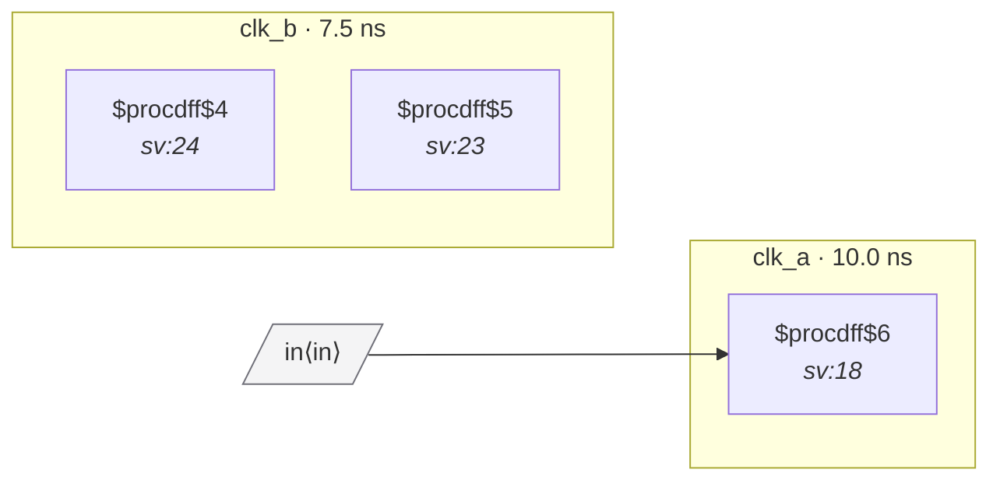

# Fixture: `good_unconstrained_input_two_domains_typed`

<!-- generator: scripts/gen_fixture_docs.py -->

Positive counterpart to bad_unconstrained_input_two_domains.

The SDC types `in` against `clk_a` via `set_input_delay -clock` and the RTL adds a 2FF synchronizer on the `clk_b` side, so the methodology gap CDC-011 surfaced is fully resolved: CDC-011 stays silent (port is typed), CDC-001 stays silent (chain depth >= 2 on the foreign-domain capture). The textbook fix shape.

- **Status:** positive — textbook fix; analyzer must stay silent
- **Top module:** `good_unconstrained_input_two_domains_typed`
- **Clocks:** `clk_a` (10.0 ns), `clk_b` (7.5 ns)
- **Crossings:** 1 structural (1 async-per-SDC, 0 sync)

## Clock-domain map

## Files

- `good_unconstrained_input_two_domains_typed.json`
- `good_unconstrained_input_two_domains_typed.sdc`
- `good_unconstrained_input_two_domains_typed.sv`

---
*Generated by `scripts/gen_fixture_docs.py` — re-run after editing the SV/SDC/netlist.*
