# Fixture: `icg_port_enable`

<!-- generator: scripts/gen_fixture_docs.py -->

icg_port_enable — the COMMON, safe ICG shape and the regression guard for the clock-combining decline (#263): a latch-based integrated clock gate whose clock is on D and whose ENABLE comes from a top-level input port (`en`). Because `en` is NOT a declared clock, this is a single clock + enable — it must STILL resolve to `clk` (NOT be mistaken for a two-clock combine and declined). Guards against the obvious-but-wrong "decline whenever two legs resolve" fix, which would wrongly strand every port-enabled clock gate.

- **Status:** auxiliary
- **Top module:** `icg_port_enable`
- **Clocks:** `clk` (10.0 ns)
- **Crossings:** 0 structural (0 async-per-SDC, 0 sync)

## Clock-domain map

```mermaid
%% icg_port_enable — generated by rtl-buddy-cdc render
flowchart LR
  subgraph clk_clk["clk · 10.0 ns"]
    direction TB
  end
  style clk_clk fill:none,stroke:#cbd5e1
  classDef ckcls_clk fill:#e0f2fe,stroke:#0369a1,stroke-width:1.5px,color:#0f172a
  classDef port_unassigned fill:#f4f4f5,stroke:#71717a,color:#0f172a
  classDef ckcls_legend_neutral fill:#ffffff,stroke:#cbd5e1,stroke-width:1px,color:#0f172a
```

## Files

- `icg_port_enable.json`
- `icg_port_enable.sdc`
- `icg_port_enable.sv`

---
*Generated by `scripts/gen_fixture_docs.py` — re-run after editing the SV/SDC/netlist.*
