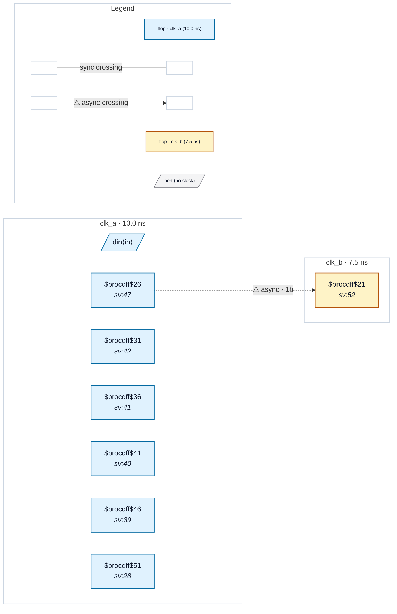

# Fixture: `inferred_fwd_clock`

<!-- generator: scripts/gen_fixture_docs.py -->

inferred_fwd_clock — an undeclared internal generated clock (P3/#263).

`clk_div` is a divide-by-2 toggle flop on `clk_a`: its Q is wired directly into the CLK pin of a four-flop bank. The SDC declares only `clk_a` and `clk_b` — there is NO `create_generated_clock` for `clk_div`, so the user "forgot to declare" the forwarded/divided clock. The P3 advisory flags `clk_div`'s driver as an inferred-clock candidate (net drives >=4 flop CLK pins, not in the SDC).

The advisory is ADVISORY ONLY. The four bank flops still resolve to `clk_a` because `trace_clock_root` already follows a divider flop's Q back to its own CLK — a real clock-root trace, independent of the fanout heuristic. So the candidate report changes no domain and no crossing.

Parity anchor: `q_a` (clk_a) drives `q_b` (clk_b) directly across an async clock boundary — a genuine clk_a->clk_b crossing that must be reported identically with or without the advisory feature.

- **Status:** auxiliary
- **Top module:** `inferred_fwd_clock`
- **Clocks:** `clk_a` (10.0 ns), `clk_b` (7.5 ns)
- **Crossings:** 1 structural (1 async-per-SDC, 0 sync)

## Clock-domain map

## Files

- `inferred_fwd_clock.json`
- `inferred_fwd_clock.sdc`
- `inferred_fwd_clock.sv`

---
*Generated by `scripts/gen_fixture_docs.py` — re-run after editing the SV/SDC/netlist.*
