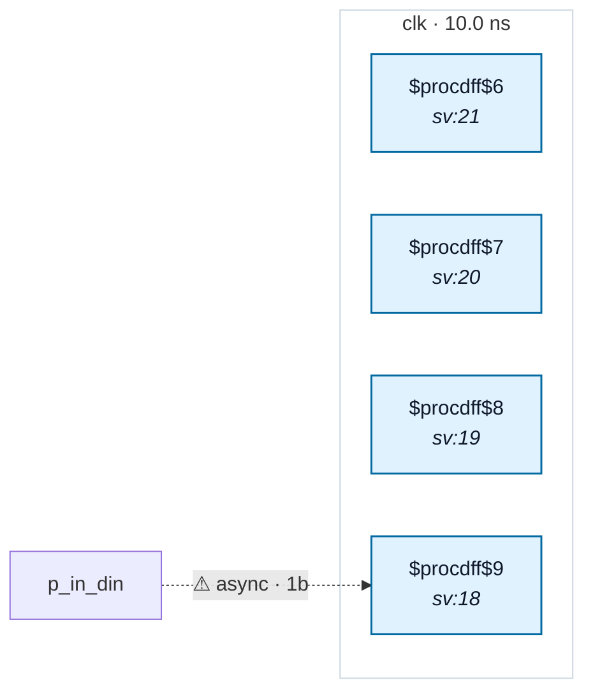

# Fixture: `inferred_gate_clock`

<!-- generator: scripts/gen_fixture_docs.py -->

inferred_gate_clock — an undeclared internal clock whose driver is a clock GATE / ICG output (not a flop Q). `gclk = clk & en` fans out to four separate flop CLK pins and is never declared with create_generated_clock, so it is reported as an inferred-clock candidate with driver_kind="gate" (issue #263, P3). Advisory only: the four flops still resolve to `clk` via the gate clause, so no domain or crossing changes — this fixture exercises the gate-driver branch of candidate detection. Four single-bit always blocks keep yosys from packing them into one multi-bit flop.

- **Status:** auxiliary
- **Top module:** `inferred_gate_clock`
- **Clocks:** `clk` (10.0 ns)
- **Crossings:** 1 structural (1 async-per-SDC, 0 sync)

## Clock-domain map

## Files

- `inferred_gate_clock.json`
- `inferred_gate_clock.sdc`
- `inferred_gate_clock.sv`

---
*Generated by `scripts/gen_fixture_docs.py` — re-run after editing the SV/SDC/netlist.*
