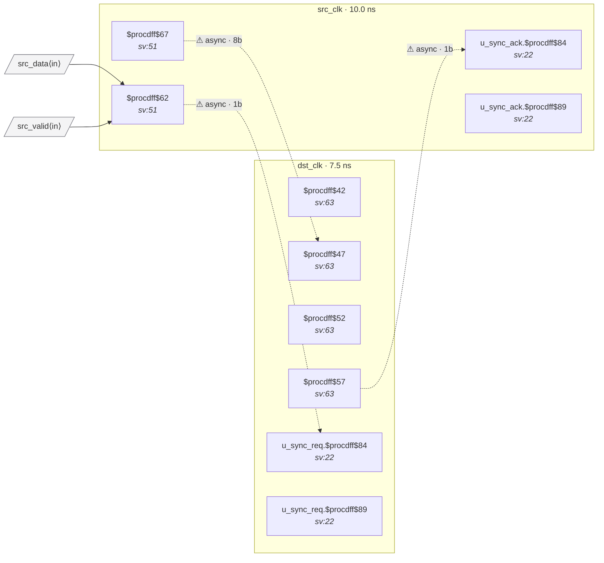

# Fixture: `ip_cdc_handshake`

A small two-clock IP used as the canonical golden-path CDC test case.

Vendored (with attribution) from
[`rtl-buddy-project-template/design/common`](https://github.com/rtl-buddy/rtl-buddy-project-template/tree/feature/new-rtl-buddy-capabilities/design/common):

- `ip_cdc_handshake.sv` — top-level DUT (4-phase req/ack vector CDC)
- `ip_cdc_sync.sv` — 2-flop level synchronizer (instantiated twice)
- `ip_cdc_handshake.sdc` — minimal stub: two `create_clock` declarations and
  one `set_clock_groups -asynchronous`

## Why this design

- **Two distinct clock domains as top-level ports** (`src_clk`, `dst_clk`),
  cleanly expressible in SDC.
- **Real-world CDC patterns in 81 lines** — two 2FF level synchronizers plus
  a req/ack handshake gating a multi-bit data path. The data bus is *not*
  synchronized but is *gated* by a synchronized req — the kind of
  structure a CDC linter must learn to recognise as correct rather than
  flagging as an unsynchronized bus.
- Self-contained — no dependencies outside the two vendored files.

## Clock-domain map

(Refresh with `uv run rtl-buddy-cdc analyze --netlist ip_cdc_handshake.json --sdc ip_cdc_handshake.sdc --emit-domain-map /tmp/m.json --no-findings && uv run rtl-buddy-cdc render --map /tmp/m.json`.)

## Expected analyzer behaviour

- **Golden run** (this fixture as-is): zero violations.
- **Mutated runs** (future negative tests, generate by editing copies of the SV):
  - Reduce a synchronizer's `STAGES` to 1 → expect CDC-002.
  - Wire `src_data` straight into a `dst_clk` flop → expect CDC-001 / CDC-004.
  - Drive `dst_ack` from a combinational expression on `req_in_dst` (no flop)
    → expect CDC-003 (combinational on the way to a synchronizer).

## Top module

`ip_cdc_handshake` (parameter `WIDTH = 8` by default).
