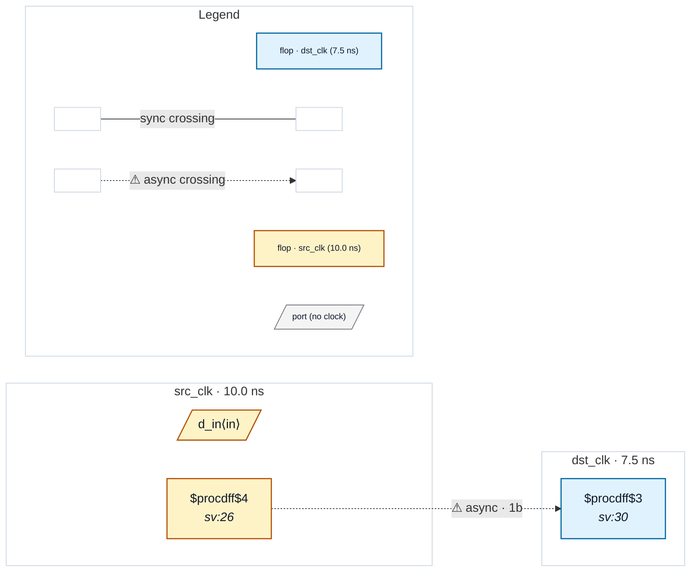

# Fixture: `marked_async_reg_upper`

<!-- generator: scripts/gen_fixture_docs.py -->

Uppercase `ASYNC_REG` recognition (rtl-buddy-cdc#275).

`USER_SYNC_ATTRS` has carried an `async_reg` alias since the marker plumbing landed — the point being to honour the Xilinx synthesis attribute that pins a synchroniser's stages into adjacent slices. But Xilinx spells it `(* ASYNC_REG = "TRUE" *)`, and Yosys preserves the attribute name verbatim, so a case-sensitive match never fired on the one idiom the alias existed for. The XPM CDC macro sources tag their internal stages exactly this way, so the same gap also closed the "user put the XPM sources in the filelist" route.

This fixture is a SINGLE-stage crossing — structurally a CDC-001 — held silent purely by the uppercase attribute. If the case-fold regresses, CDC-001 fires and the test fails loudly. (The lowercase spelling is covered by marked_single_ff_sync; this fixture is the case-sensitivity twin.)

- **Status:** marker — exercises an SV attribute (`cdc_sync` / `cdc_gray` / …)
- **Top module:** `marked_async_reg_upper`
- **Clocks:** `dst_clk` (7.5 ns), `src_clk` (10.0 ns)
- **Crossings:** 1 structural (1 async-per-SDC, 0 sync)

## Clock-domain map

## Files

- `marked_async_reg_upper.json`
- `marked_async_reg_upper.sdc`
- `marked_async_reg_upper.sv`

---
*Generated by `scripts/gen_fixture_docs.py` — re-run after editing the SV/SDC/netlist.*
