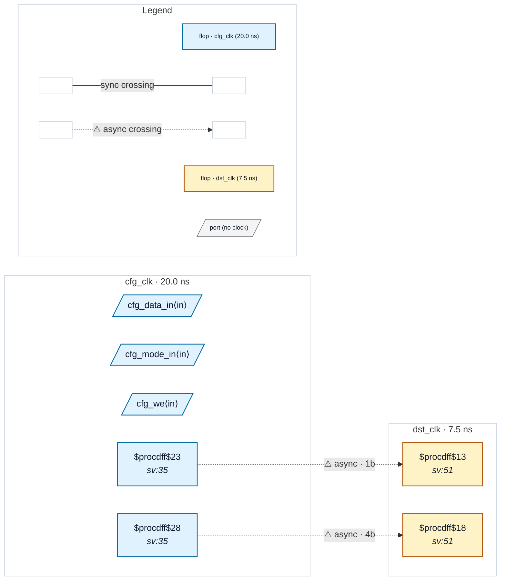

# Fixture: `marked_quasi_static`

<!-- generator: scripts/gen_fixture_docs.py -->

Positive-case fixture for the `(* cdc_static *)` attribute (issue #173). Configuration / mode bits are programmed once at boot and then held constant during the operating window; they are structurally cross-domain crossings without a synchroniser, but the metastability failure mode CDC-001 / CDC-004 target cannot occur because the value is not transitioning.

Both the 1-bit `cfg_mode_q` and the 4-bit `cfg_data_q` registers are annotated `(* cdc_static *)`. The dst-domain consumer (`obs_q`) samples them on `dst_clk` with NO sync chain — a depth-1 1-bit consumer would normally trip CDC-001, and a 4-bit consumer without gating / gray-coding would normally trip CDC-004. The attribute on the source flops suppresses both rules.

Paired with `bad_quasi_static_unmarked` (same RTL, no attribute): removing the annotation makes CDC-001 and CDC-004 fire as expected.

- **Status:** marker — exercises an SV attribute (`cdc_sync` / `cdc_gray` / …)
- **Top module:** `marked_quasi_static`
- **Clocks:** `cfg_clk` (20.0 ns), `dst_clk` (7.5 ns)
- **Crossings:** 2 structural (2 async-per-SDC, 0 sync)

## Clock-domain map

## Files

- `marked_quasi_static.json`
- `marked_quasi_static.sdc`
- `marked_quasi_static.sv`

---
*Generated by `scripts/gen_fixture_docs.py` — re-run after editing the SV/SDC/netlist.*
