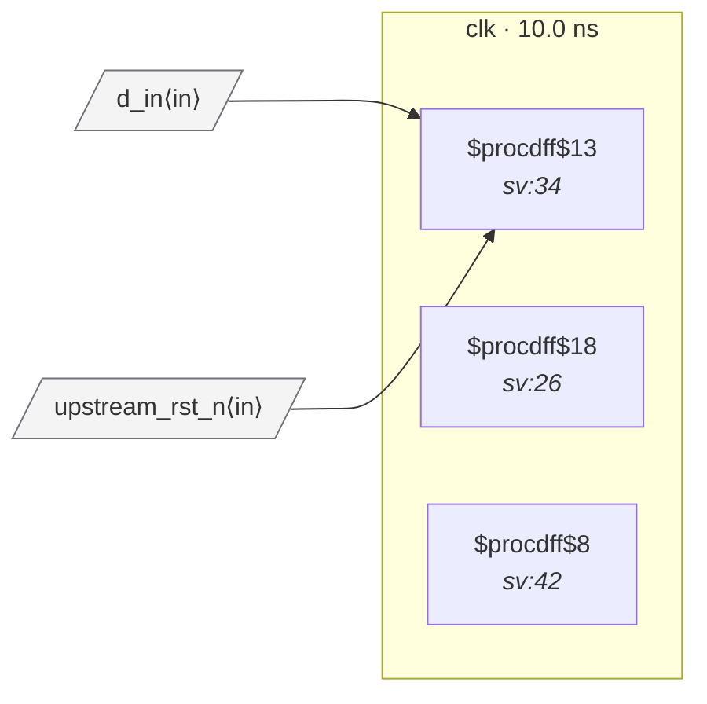

# Fixture: `marked_reset_sync`

<!-- generator: scripts/gen_fixture_docs.py -->

SV-attribute coverage fixture: (* reset_sync *) marks a flop as a user-vetted reset-synchroniser stage even when the structural recogniser wouldn't match.

The chain head's D pin is fed by `upstream_rst_n` (a port), not a constant — the structural detector in :func:`rtl_buddy_cdc.reset_domain.find_reset_synchronizers` deliberately requires a constant-fed head, so it would normally NOT classify these flops as a synchroniser. The `(* reset_sync *)` annotation overrides that decision.

Without the attribute, RDC-002 would fire on the consumer flop (`q_out`) because the producer's ARST_VALUE (=0) doesn't match q_out's ARST_POLARITY (=1). With the attribute marking the second stage of the would-be sync as recognised, RDC-002 skips q_out and no rule fires.

- **Status:** marker — exercises an SV attribute (`cdc_sync` / `cdc_gray` / …)
- **Top module:** `marked_reset_sync`
- **Clocks:** `clk` (10.0 ns)
- **Crossings:** 0 structural (0 async-per-SDC, 0 sync)

## Clock-domain map

## Files

- `marked_reset_sync.json`
- `marked_reset_sync.sdc`
- `marked_reset_sync.sv`

---
*Generated by `scripts/gen_fixture_docs.py` — re-run after editing the SV/SDC/netlist.*
