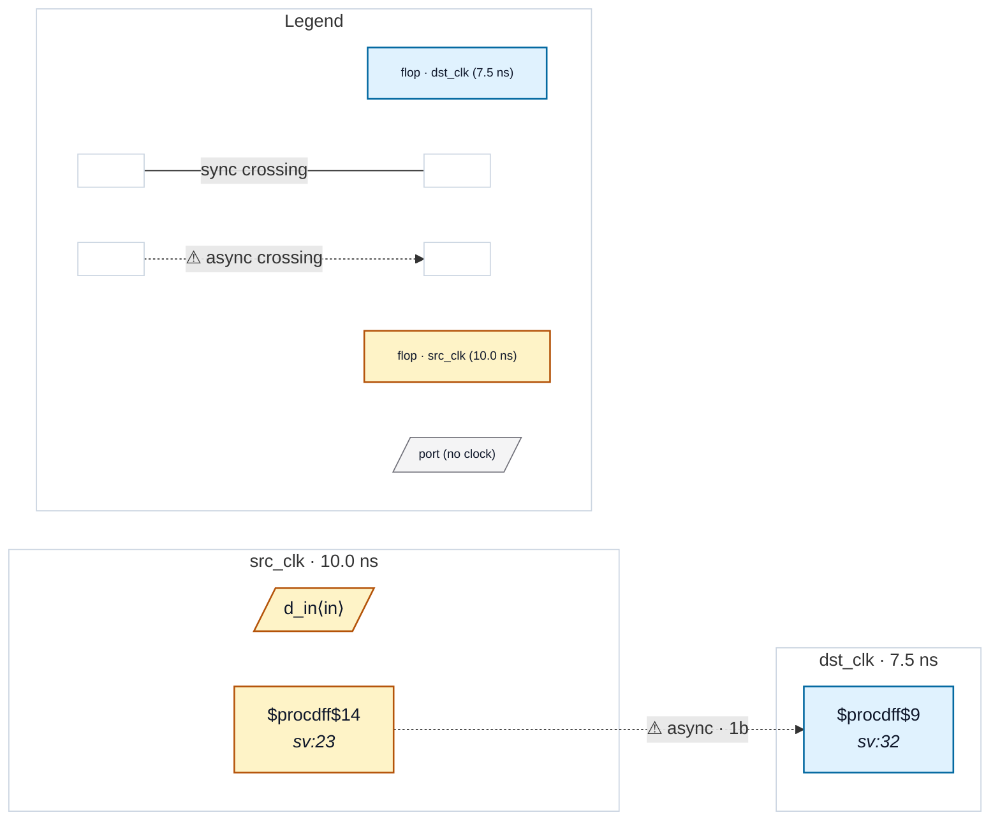

# Fixture: `marked_single_ff_sync`

<!-- generator: scripts/gen_fixture_docs.py -->

Coverage for `(* cdc_sync *)` suppressing CDC-001 on a single dst flop.

Structurally identical to `bad_single_ff_sync` — one source flop, a single destination flop, no second-stage synchronizer — but the destination flop's netname carries `(* cdc_sync = "level_2ff" *)`. The marker is the user asserting "this is a vetted synchronizer first stage even though the structural depth is 1"; CDC-001/-002/-003 must skip it.

Paired with `bad_single_ff_sync` (must fire) and with `marked_user_sync` (the marker on a conventional 2FF chain).

- **Status:** marker — exercises an SV attribute (`cdc_sync` / `cdc_gray` / …)
- **Top module:** `marked_single_ff_sync`
- **Clocks:** `dst_clk` (7.5 ns), `src_clk` (10.0 ns)
- **Crossings:** 1 structural (1 async-per-SDC, 0 sync)

## Clock-domain map

## Files

- `marked_single_ff_sync.json`
- `marked_single_ff_sync.sdc`
- `marked_single_ff_sync.sv`

---
*Generated by `scripts/gen_fixture_docs.py` — re-run after editing the SV/SDC/netlist.*
