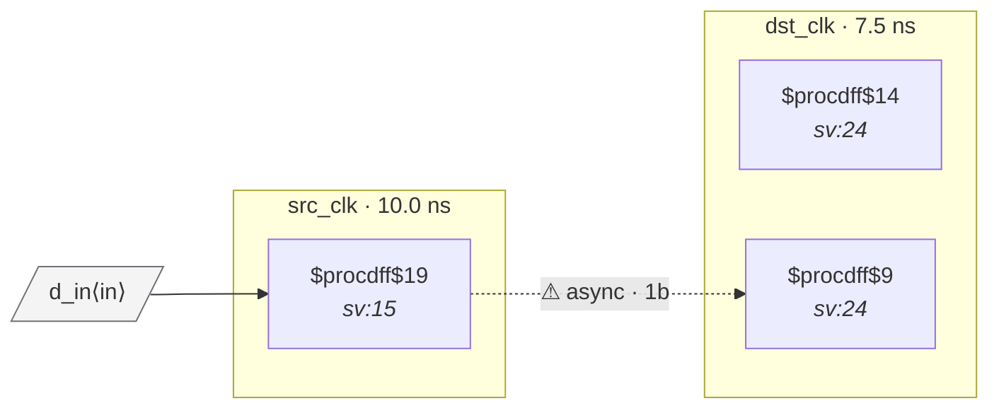

# Fixture: `marked_user_sync`

<!-- generator: scripts/gen_fixture_docs.py -->

Mark a conventional 2FF synchronizer with `(* cdc_sync *)` to declare the first stage as user-vetted. The structural depth keeps both rtl-buddy-cdc and SpyGlass clean; the attribute exercises the marker plumbing without relying on a single-stage waiver.

- **Status:** marker — exercises an SV attribute (`cdc_sync` / `cdc_gray` / …)
- **Top module:** `marked_user_sync`
- **Clocks:** `dst_clk` (7.5 ns), `src_clk` (10.0 ns)
- **Crossings:** 1 structural (1 async-per-SDC, 0 sync)

## Clock-domain map

## Files

- `marked_user_sync.json`
- `marked_user_sync.sdc`
- `marked_user_sync.sv`

---
*Generated by `scripts/gen_fixture_docs.py` — re-run after editing the SV/SDC/netlist.*
