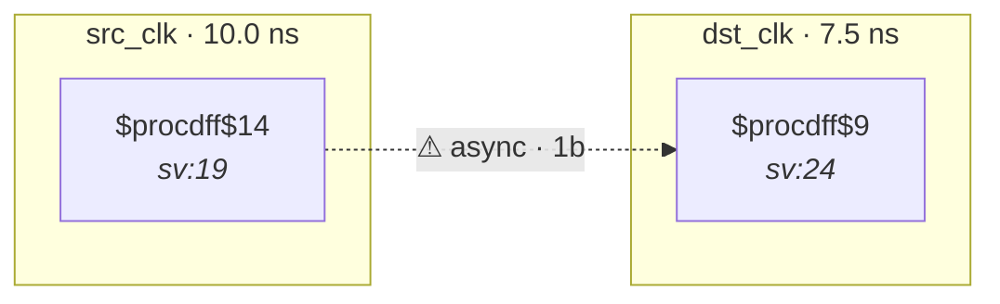

# Fixture: `marked_user_sync_port`

<!-- generator: scripts/gen_fixture_docs.py -->

Variant of `marked_user_sync` that tags the destination flop via the **output port** declaration instead of an internal `logic`. The structural shape (single dst flop, no second stage) still trips CDC-001 unless the port-level `(* cdc_sync *)` reaches the netname — see issue #38.

- **Status:** marker — exercises an SV attribute (`cdc_sync` / `cdc_gray` / …)
- **Top module:** `marked_user_sync_port`
- **Clocks:** `dst_clk` (7.5 ns), `src_clk` (10.0 ns)
- **Crossings:** 2 structural (2 async-per-SDC, 0 sync)

## Clock-domain map

## Files

- `marked_user_sync_port.json`
- `marked_user_sync_port.sdc`
- `marked_user_sync_port.sv`

---
*Generated by `scripts/gen_fixture_docs.py` — re-run after editing the SV/SDC/netlist.*
