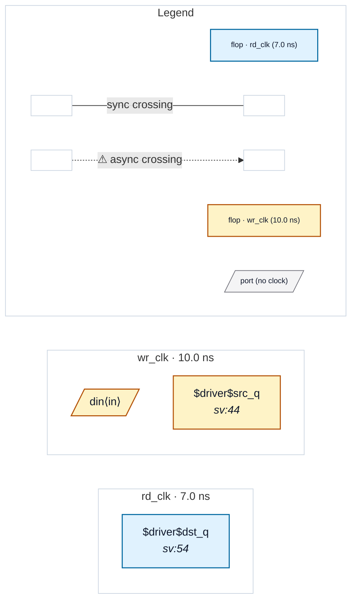

# Fixture: `multi_clock_blackbox`

<!-- generator: scripts/gen_fixture_docs.py -->

Multi-clock blackbox soundness fixture (rtl-buddy-cdc#259 audit, FIX 1).

`afifo` is a dual-clock IP (an async-FIFO shape) whose clock pins are `wr_clk` and `rd_clk` — names that are NOT in the summariser's clock-pin allow-list. It carries a REAL internal wr_clk -> rd_clk crossing: a wr_clk register drives a rd_clk register directly.

The bug FIX 1 closes: the pre-#259 `_instance_clock` only recognised a clock pin by NAME, so when `afifo` is blackboxed its clock set resolved to a single domain (or none) and the block was abstracted as if it were single-clock / combinational — its internal clkA->clkB crossing VANISHED silently.

FLAT: the wr_clk -> rd_clk crossing fires (CDC-004 / CDC-001). BLACKBOXED: the dual-clock block is DECLINED (>=2 distinct clock roots), a partial_warning names it, and the run does NOT falsely report it clean.

- **Status:** auxiliary
- **Top module:** `multi_clock_blackbox`
- **Clocks:** `rd_clk` (7.0 ns), `wr_clk` (10.0 ns)
- **Crossings:** 0 structural (0 async-per-SDC, 0 sync)

## Clock-domain map

## Files

- `multi_clock_blackbox.flat.json`
- `multi_clock_blackbox.grey.json`
- `multi_clock_blackbox.json`
- `multi_clock_blackbox.sdc`
- `multi_clock_blackbox.sv`

---
*Generated by `scripts/gen_fixture_docs.py` — re-run after editing the SV/SDC/netlist.*
