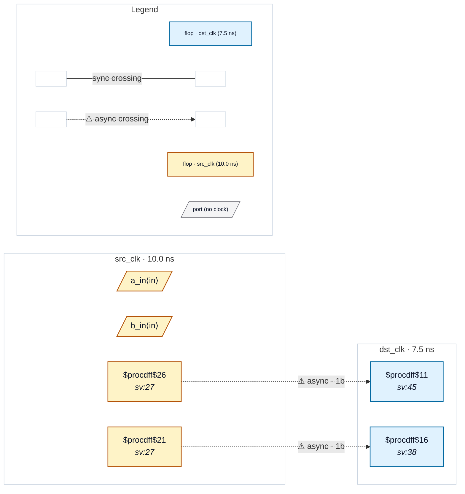

# Fixture: `pragma_block_scope`

<!-- generator: scripts/gen_fixture_docs.py -->

Block-scoped in-RTL pragma fixture: two identical single-flop control crossings src_clk -> dst_clk, both of which trip CDC-001. The first sits inside a disable-rule / enable-rule pragma block for CDC-001 and is suppressed; the second sits after the block closes and still fires. The pair is the regression net for the half-open [disable, enable) range. (The pragma text itself is only written below, in the code — a prose copy of it up here would open a second region, since the scanner reads every comment line.)

```text
       src_clk               dst_clk
  ┌──[ src_a ]──────────[ dst_a ]──  inside the block  → waived
  └──[ src_b ]──────────[ dst_b ]──  outside the block → CDC-001
```

- **Status:** auxiliary
- **Top module:** `pragma_block_scope`
- **Clocks:** `dst_clk` (7.5 ns), `src_clk` (10.0 ns)
- **Crossings:** 2 structural (2 async-per-SDC, 0 sync)

## Clock-domain map



## Files

- `pragma_block_scope.json`
- `pragma_block_scope.sdc`
- `pragma_block_scope.sv`

---
*Generated by `scripts/gen_fixture_docs.py` — re-run after editing the SV/SDC/netlist.*
