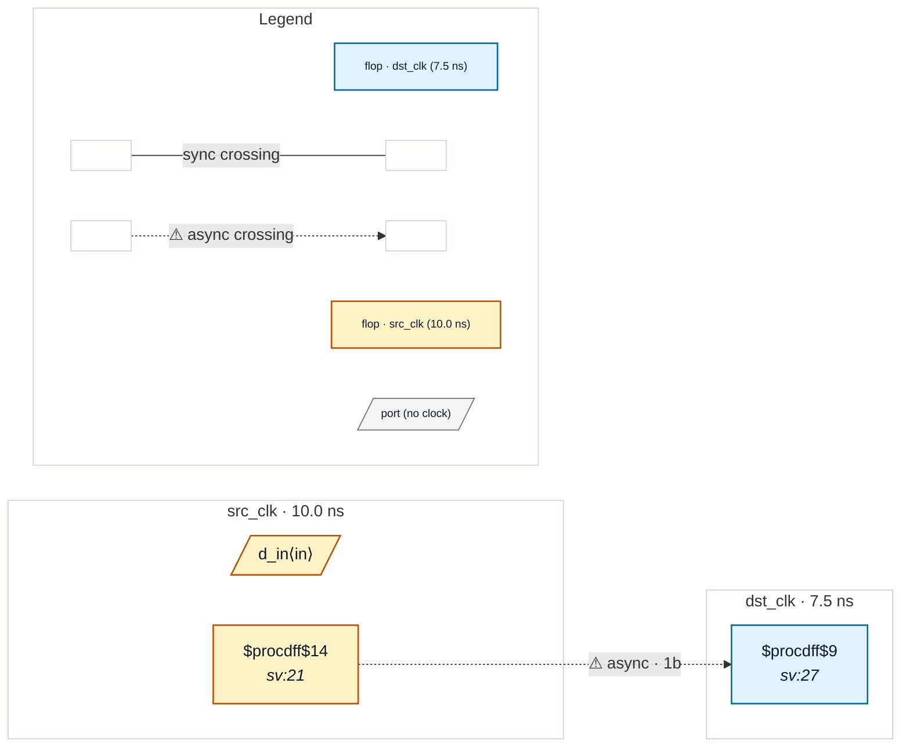

# Fixture: `pragma_waived_single_ff`

<!-- generator: scripts/gen_fixture_docs.py -->

In-RTL pragma fixture: the same single-flop control crossing as `bad_single_ff_sync` (CDC-001 fires), waived in place by an `// rbcdc: disable-rule` magic comment instead of an external waiver file. The run reports the finding as suppressed and exits 0.

```text
       src_clk          dst_clk
  ┌──[ src_q ]──────[ dst_q ]──── (no further flop on dst_clk)
  only 1 stage on the destination side → CDC-001, waived by pragma
```

- **Status:** auxiliary
- **Top module:** `pragma_waived_single_ff`
- **Clocks:** `dst_clk` (7.5 ns), `src_clk` (10.0 ns)
- **Crossings:** 1 structural (1 async-per-SDC, 0 sync)

## Clock-domain map



## Files

- `pragma_waived_single_ff.json`
- `pragma_waived_single_ff.sdc`
- `pragma_waived_single_ff.sv`

---
*Generated by `scripts/gen_fixture_docs.py` — re-run after editing the SV/SDC/netlist.*
