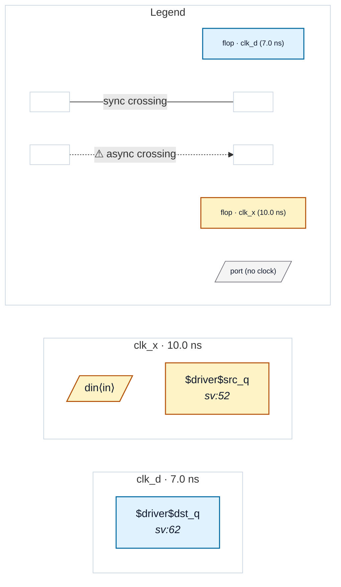

# Fixture: `reconvergence_two_inputs`

<!-- generator: scripts/gen_fixture_docs.py -->

Reconvergence-unsafe blackbox fixture (rtl-buddy-cdc#259 audit, FIX 3).

`recon` is a SINGLE-CLOCK (clk_d) block with TWO separate inputs, `a_in` and `b_in`. ONE foreign-domain (clk_x) source register in the parent fans out to BOTH inputs; each input passes through an independent two-flop synchroniser chain inside `recon`, and the two chain outputs RECONVERGE (a2 ^ b2) into one clk_d register. A single source fanning out to two independent sync chains that recombine is the textbook CDC-005 reconvergence hazard.

The bug FIX 3 closes: a single-clock block that IS abstracted but has >=2 distinct foreign-domain crossings entering DISTINCT input ports can hide that internal reconvergence — the boundary star-collapse severs the internal graph, so the reconvergence among those ports cannot be checked at the boundary. Conservative policy: REFUSE to abstract such a block.

FLAT: CDC-005 reconvergence fires. BLACKBOXED: reconvergence-unsafe — the linter SKIPS blackboxing (the block is refused / opaque) and emits the reconvergence diagnostic; it does NOT report the block as clean.

- **Status:** auxiliary
- **Top module:** `reconvergence_two_inputs`
- **Clocks:** `clk_d` (7.0 ns), `clk_x` (10.0 ns)
- **Crossings:** 0 structural (0 async-per-SDC, 0 sync)

## Clock-domain map

## Files

- `reconvergence_two_inputs.flat.json`
- `reconvergence_two_inputs.json`
- `reconvergence_two_inputs.sdc`
- `reconvergence_two_inputs.sv`

---
*Generated by `scripts/gen_fixture_docs.py` — re-run after editing the SV/SDC/netlist.*
