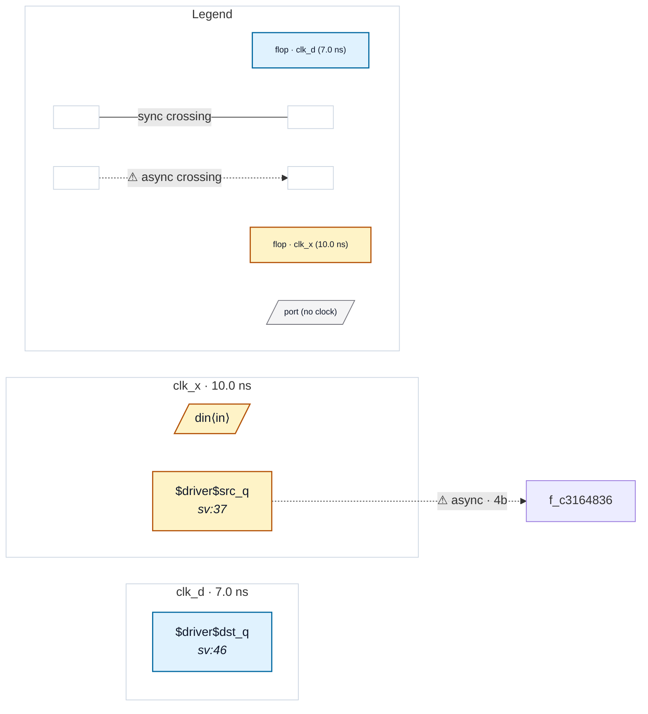

# Fixture: `safe_single_input`

<!-- generator: scripts/gen_fixture_docs.py -->

Safe single-input blackbox fixture (rtl-buddy-cdc#259 audit, FIX 3 guard against over-firing).

`oneport` is a SINGLE-CLOCK (clk_d) block with exactly ONE foreign-domain (clk_x) input crossing entering ONE input port, `d_in`. With only one incoming boundary port the reconvergence gate (FIX 3) must NOT fire — there is nothing to reconverge at the boundary — so the block is still abstracted cleanly and the crossing is reported with parity to the flattened design.

FLAT: reports the clk_x -> clk_d crossing. BLACKBOXED: abstracted cleanly, the SAME crossing reported (parity), and NO decline / reconvergence warning.

- **Status:** auxiliary
- **Top module:** `safe_single_input`
- **Clocks:** `clk_d` (7.0 ns), `clk_x` (10.0 ns)
- **Crossings:** 1 structural (1 async-per-SDC, 0 sync)

## Clock-domain map

## Files

- `safe_single_input.flat.json`
- `safe_single_input.grey.json`
- `safe_single_input.json`
- `safe_single_input.sdc`
- `safe_single_input.sv`

---
*Generated by `scripts/gen_fixture_docs.py` — re-run after editing the SV/SDC/netlist.*
