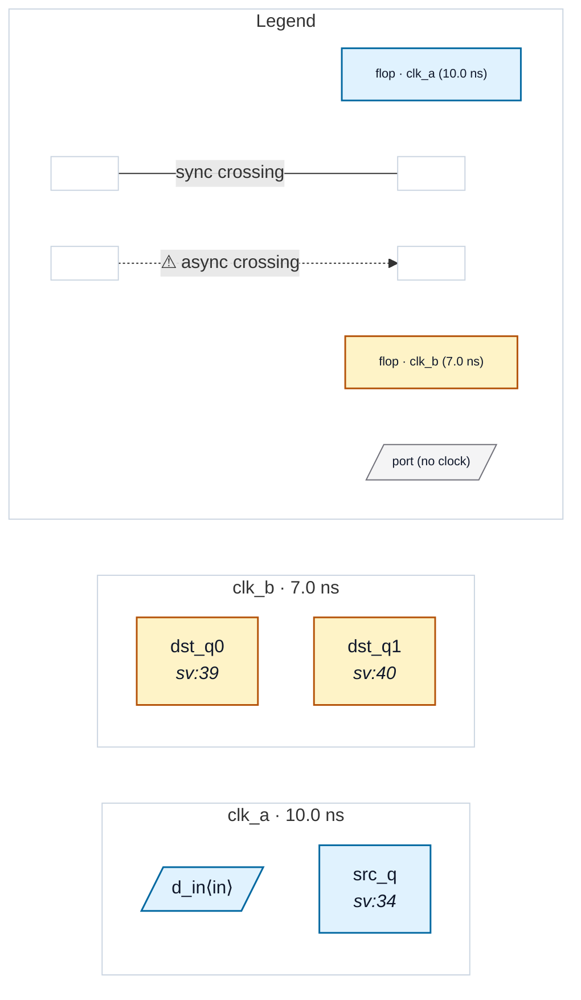

# Fixture: `shared_subtree_compose`

<!-- generator: scripts/gen_fixture_docs.py -->

shared_subtree_compose — P3 (#257) hierarchical / compositional parity.

One single-clock subtree (`pipe`, clk_a only) instantiated TWICE (`u_pipe0`, `u_pipe1`). Both instances feed clk_b destination flops, so each carries an async clk_a -> clk_b crossing at its output.

The whole point of phase 3: the abstracted run summarises `pipe` ONCE (cache by module identity) and re-applies that boundary to both instances, yet produces the SAME violations as the flattened run that inlines both copies. The destination flops (`dst_q0` / `dst_q1`) are real top-level flops present in both views, so the CDC-004 anchors match cell-for-cell — parity.

- **Status:** auxiliary
- **Top module:** `shared_subtree_compose`
- **Clocks:** `clk_a` (10.0 ns), `clk_b` (7.0 ns)
- **Crossings:** 2 structural (2 async-per-SDC, 0 sync)

## Clock-domain map

## Files

- `shared_subtree_compose.flat.json`
- `shared_subtree_compose.json`
- `shared_subtree_compose.sdc`
- `shared_subtree_compose.sv`

---
*Generated by `scripts/gen_fixture_docs.py` — re-run after editing the SV/SDC/netlist.*
