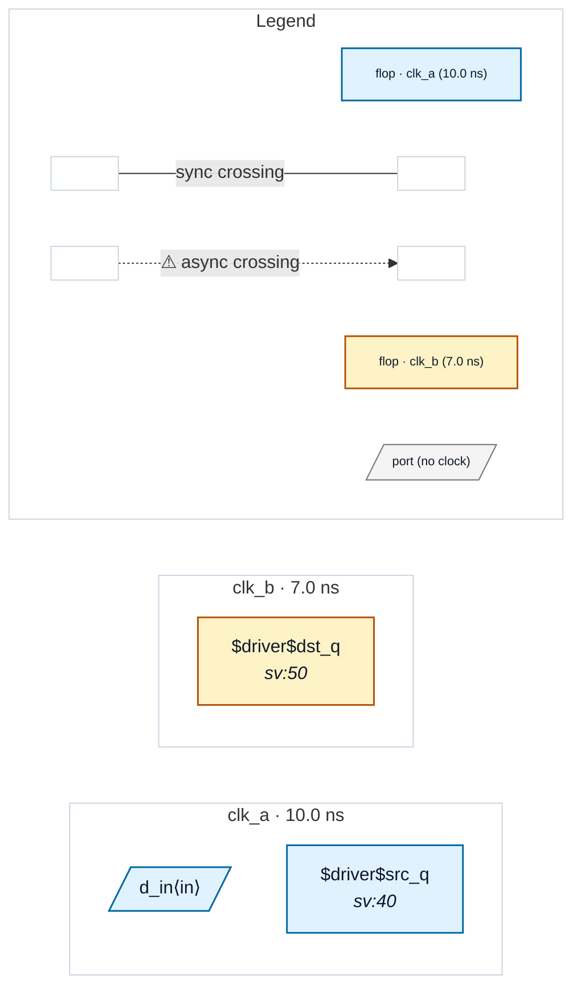

# Fixture: `single_clock_leaf_abstract`

<!-- generator: scripts/gen_fixture_docs.py -->

P2 auto-abstract single-clock-subtree fixture (#256).

`top` runs two async clocks, clk_a and clk_b. A leaf sub-block, `pipe`, is a pure clk_a pipeline (two clk_a stages, no second clock) — a SINGLE-CLOCK subtree that carries no internal crossing. Its input comes from a clk_a parent flop (same domain, no crossing in) and its output is captured by a clk_b parent flop (the one real async crossing, clk_a -> clk_b).

The safety property P2 must preserve: analysing the FLATTENED design (pipe inlined, the crossing is src_q->...->dst_q flop-to-flop) and analysing the AUTO-ABSTRACTED design (pipe blackboxed, summarised to its port boundary so the crossing is re-seeded from pipe.d_out as a virtual source) must produce identical violations and identical summary.* counts. The abstracted design has fewer flops to walk (pipe's two internal stages are gone), which is the scaling win.

- **Status:** auxiliary
- **Top module:** `single_clock_leaf_abstract`
- **Clocks:** `clk_a` (10.0 ns), `clk_b` (7.0 ns)
- **Crossings:** 1 structural (1 async-per-SDC, 0 sync)

## Clock-domain map

## Files

- `single_clock_leaf_abstract.flat.json`
- `single_clock_leaf_abstract.grey.json`
- `single_clock_leaf_abstract.json`
- `single_clock_leaf_abstract.sdc`
- `single_clock_leaf_abstract.sv`

---
*Generated by `scripts/gen_fixture_docs.py` — re-run after editing the SV/SDC/netlist.*
