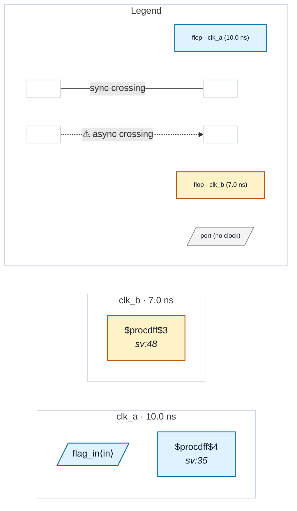

# Fixture: `sync_primitive_optin`

<!-- generator: scripts/gen_fixture_docs.py -->

Site-registered CDC primitive via `--sync-primitive` (rtl-buddy-cdc#275).

The XPM family is recognised built-in, but plenty of shops wrap their own blessed synchroniser (or use another vendor's macro). `acme_cdc_sync` is that shape: a dual-clock blackbox that is a correct synchroniser, which the analyzer has no way to know about a priori.

Without `--sync-primitive acme_cdc_sync` this design reports a CDC-BBX error (dual-clock blackbox, not provably single-clock). With it, the instance is summarised at its `dest_clk` domain and the design is clean.

Note the deliberate difference from XPM: `port_domain` only honours the `src_*` / `dest_*` convention for the XPM family, so a registered primitive's outputs are ALL attributed to the destination clock — the conservative reading, since we have no promise about its port naming.

- **Status:** auxiliary
- **Top module:** `sync_primitive_optin`
- **Clocks:** `clk_a` (10.0 ns), `clk_b` (7.0 ns)
- **Crossings:** 0 structural (0 async-per-SDC, 0 sync)

## Clock-domain map

## Files

- `sync_primitive_optin.json`
- `sync_primitive_optin.sdc`
- `sync_primitive_optin.sv`

---
*Generated by `scripts/gen_fixture_docs.py` — re-run after editing the SV/SDC/netlist.*
