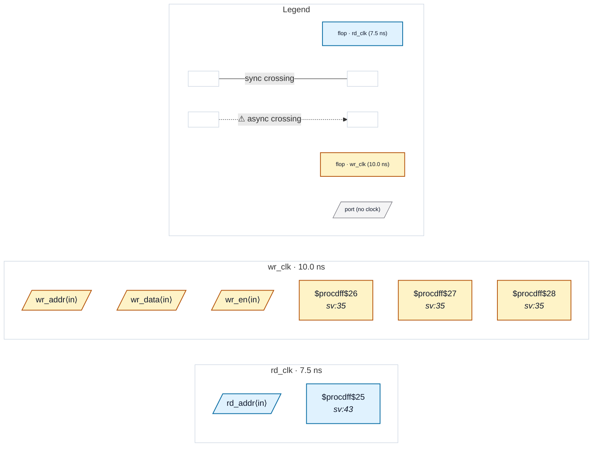

# Fixture: `unsupported_dualport_ram_crossing`

<!-- generator: scripts/gen_fixture_docs.py -->

Sentinel fixture for a known coverage gap (issue #176): rtl-buddy-cdc is a flop-based analyzer and does not model dual-port-RAM clock- domain crossings.

This design writes a small register array from `wr_clk` and reads it back from `rd_clk`. The two clocks are declared asynchronous in the SDC. In real silicon the read-port samples can be metastable (the storage is not synchronised) — a vendor memory-compiler CDC report is the right tool for this shape. rtl-buddy-cdc currently reports nothing on the memory-side data path; the paired test pins that behaviour so future changes either keep it or surface explicitly as a regression.

- **Status:** auxiliary
- **Top module:** `unsupported_dualport_ram_crossing`
- **Clocks:** `rd_clk` (7.5 ns), `wr_clk` (10.0 ns)
- **Crossings:** 0 structural (0 async-per-SDC, 0 sync)

## Clock-domain map

## Files

- `unsupported_dualport_ram_crossing.json`
- `unsupported_dualport_ram_crossing.sdc`
- `unsupported_dualport_ram_crossing.sv`

---
*Generated by `scripts/gen_fixture_docs.py` — re-run after editing the SV/SDC/netlist.*
