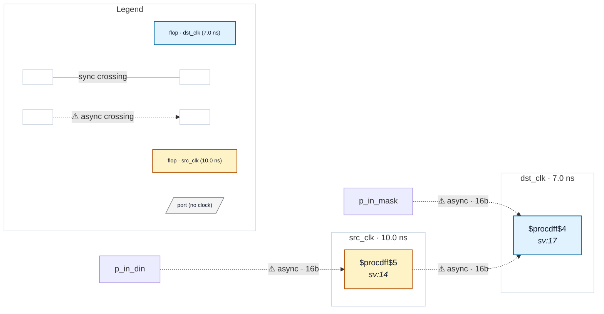

# Fixture: `wide_bus_lane_crossing`

<!-- generator: scripts/gen_fixture_docs.py -->

Wide (16-bit) LANE-ALIGNED bus crossing: src_clk -> dst_clk through a bitwise AND ($and). Each destination lane i depends only on source lane i, so the lane-aware data-fanout (issue #258) propagates bit-precisely (src[i] -> Y[i] -> dst[i]) instead of fanning each source bit across all 16 outputs. The reported crossing must be unchanged: one src->dst bus crossing, width 16.

- **Status:** auxiliary
- **Top module:** `wide_bus_lane_crossing`
- **Clocks:** `dst_clk` (7.0 ns), `src_clk` (10.0 ns)
- **Crossings:** 3 structural (3 async-per-SDC, 0 sync)

## Clock-domain map

## Files

- `wide_bus_lane_crossing.json`
- `wide_bus_lane_crossing.sdc`
- `wide_bus_lane_crossing.sv`

---
*Generated by `scripts/gen_fixture_docs.py` — re-run after editing the SV/SDC/netlist.*
