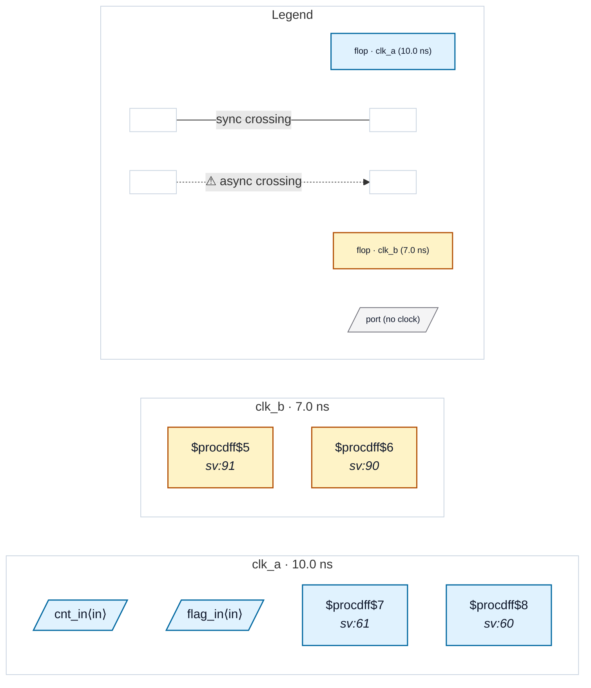

# Fixture: `xpm_cdc_blackbox`

<!-- generator: scripts/gen_fixture_docs.py -->

XPM CDC macro recognition (rtl-buddy-cdc#275).

The Xilinx XPM CDC library is how real Vivado designs synchronise: `xpm_cdc_single` for a control bit, `xpm_cdc_gray` for a counter. Their sources live in the vendor install tree, so a filelist built from project RTL carries only the instantiation — the macro arrives as a dual-clock BLACKBOX (`src_clk` + `dest_clk`).

Without primitive recognition that blackbox is "not provably single-clock", so it is declined and reported as a CDC-BBX error per instance, while the crossing through it silently vanishes. With recognition the macro is summarised as a synchroniser: its outputs are stamped in the `dest_clk` domain and its data inputs seed no virtual sink, so the design reports CLEAN.

The stubs below are port/parameter-faithful to UG974 and deliberately bodyless — that is exactly what the analyzer sees in production.

- **Status:** auxiliary
- **Top module:** `xpm_cdc_blackbox`
- **Clocks:** `clk_a` (10.0 ns), `clk_b` (7.0 ns)
- **Crossings:** 0 structural (0 async-per-SDC, 0 sync)

## Clock-domain map

## Files

- `xpm_cdc_blackbox.json`
- `xpm_cdc_blackbox.sdc`
- `xpm_cdc_blackbox.sv`

---
*Generated by `scripts/gen_fixture_docs.py` — re-run after editing the SV/SDC/netlist.*
