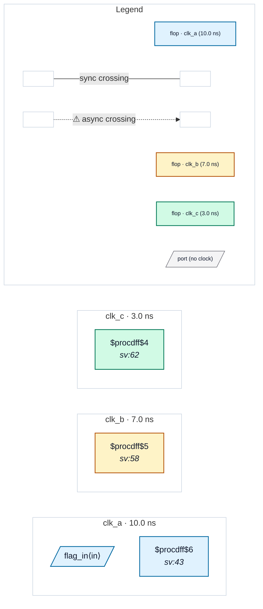

# Fixture: `xpm_cdc_third_domain`

<!-- generator: scripts/gen_fixture_docs.py -->

Over-suppression guard for XPM CDC macro recognition (rtl-buddy-cdc#275).

Recognising `xpm_cdc_single` as a synchroniser must accept the crossing the macro HANDLES without blinding the analyzer to the one it does not. The macro synchronises clk_a -> clk_b. Its `dest_out` then fans out to TWO consumers:

```text
  - `flag_b` in clk_b — the domain the macro delivered into. Safe,
    and correctly silent.
  - `flag_c` in clk_c — a THIRD domain the macro knows nothing
    about. That is a genuine unsynchronised crossing and CDC-001
    must still fire on it.
```

The mechanism: the boundary summary stamps `dest_out` with the resolved `dest_clk` root (clk_b), so find_crossings' ordinary `dst_clock != src_clock` test emits the clk_b -> clk_c crossing while dropping the clk_b -> clk_b one. Suppression is a consequence of naming the right domain, not of an unconditional skip.

- **Status:** auxiliary
- **Top module:** `xpm_cdc_third_domain`
- **Clocks:** `clk_a` (10.0 ns), `clk_b` (7.0 ns), `clk_c` (3.0 ns)
- **Crossings:** 1 structural (1 async-per-SDC, 0 sync)

## Clock-domain map



## Files

- `xpm_cdc_third_domain.json`
- `xpm_cdc_third_domain.sdc`
- `xpm_cdc_third_domain.sv`

---
*Generated by `scripts/gen_fixture_docs.py` — re-run after editing the SV/SDC/netlist.*
